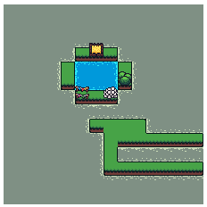

# Code Kata: Lakes and Oceans  

Rules:
 - The world is a grid
 - Identify which bodys of water are lakes and which are oceans.
 - Lakes are enclosed by land
 - The out of bounds edges of the map touch ocean.
 - When water touches the ocean, it's classified as ocean water.
 - Only N, S, E, W blocks are evaluated, diagonals are not considered to be touching.

While working at McKesson, I started the Code Workshop / Kata group. This was a kata that was submitted by a co-worker and we had some creative submissions.  
This one is mine, it's like a map editor-ish thing.  
My co-worker's submission is [here](https://github.com/aop4/sidescroller), which is pretty darn awesome.
